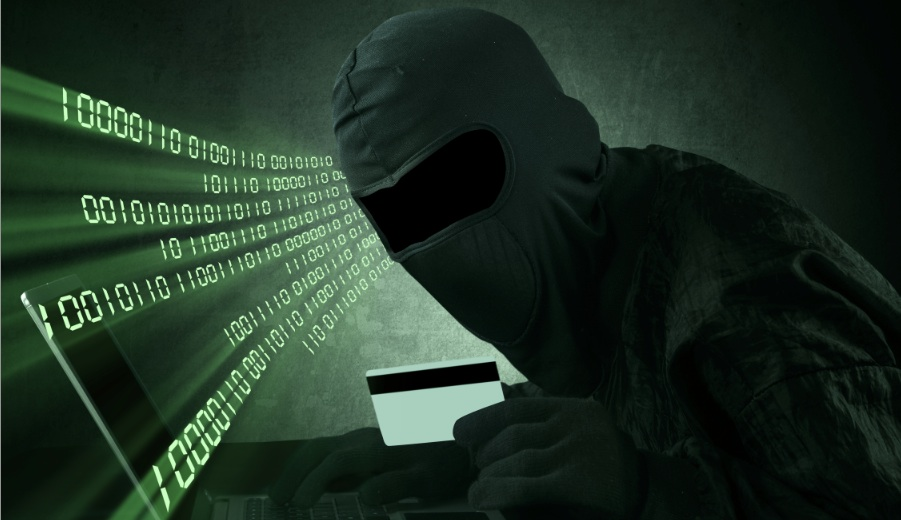
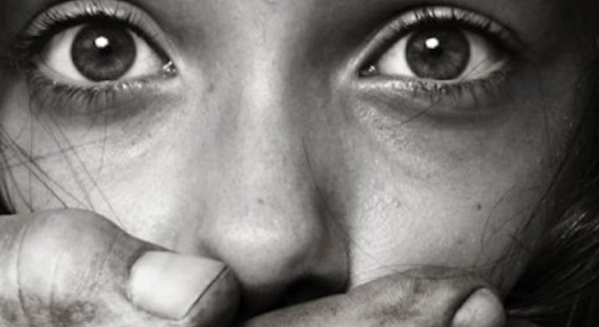
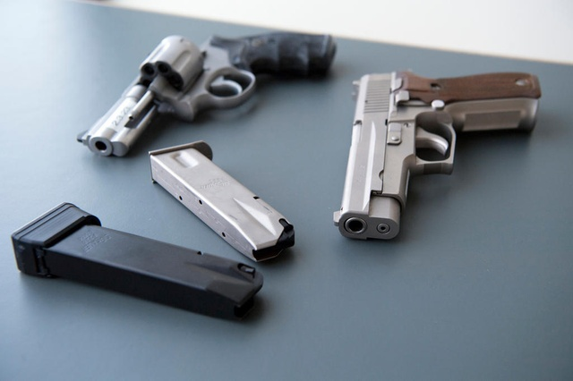
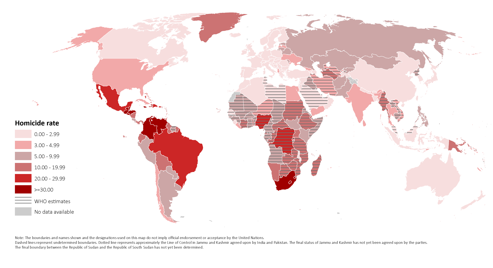
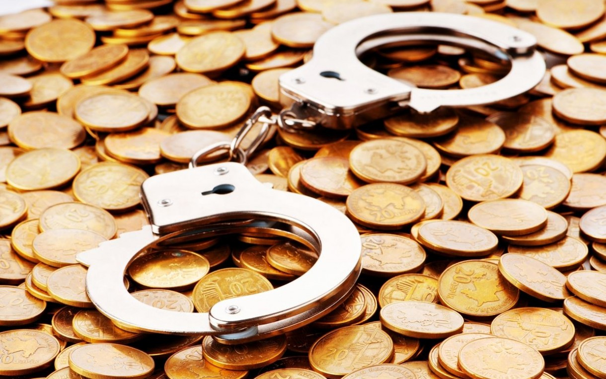
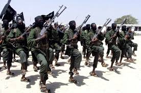
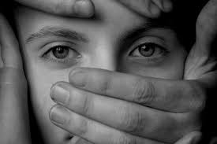
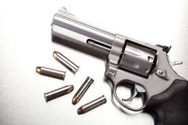
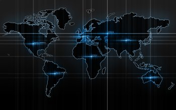

<html>
<head>
<meta charset="UTF-8">
<title>Criminal investigation command</title>
	<link rel="stylesheet" href="style.md" type="text/css">
	<meta name="viewport" content="width=device-width, initial-scale=1">

</head>

<body id="tp">
	

		
			
				
		
			<ul id="navigation" style="float:right;">
				<li class="selected">
					<a href="home.php">Home</a>
				</li>&nbsp;&nbsp;&nbsp;&nbsp;&nbsp;&nbsp;&nbsp;&nbsp;&nbsp;&nbsp;
				<li>&nbsp;&nbsp;
					<a href="public.php">Public Grievances</a>
				</li>
				<li>&nbsp;&nbsp;
					<a href="contact.php">Contact us</a>
				</li>
				<li>&nbsp;&nbsp;
					<a href="login.php">Login</a>
				</li>
				
			</ul>
			

			</body>
			<body>
			

  
  
Report Corruption Anonymously

  
  

Report Terrorists Anonymously

 
  

  
  
  
Report Human Trafficking Anonymously

  
  
  
Report Illegal Weapons Anonymously

 

  
  
  
Report Smuggling Anonymously

 

 

   
   
   
    
     

<h2>
CRIMINAL INVESTIGATION COMMAND
</h2>

Crime Stoppers International is an umbrella organization for affiliated national and local Crime Stoppers programmes in 24 countries. Together we form a global network and provide platforms for communities around the world to report on crime anonymously. 
The information provided is passed on to law enforcement and other investigators in such a way that the tipster remains anonymous at all times. When you report to Crime Stoppers your identity will never beexposed. 
We Provide Crime Information to honorable president, prime minister, Home minister, chief minister, chief Justice, lok sabha president, Supreme Court, High Court, Income Tax Department, Vigilance Department, Crime Branch C.B.I. Raw, I.B, C.I.D, Print Media, Electronic Media, Senior Journalist, Police and its administration etc. We proved Secrete Informants for taken fake Currency, Narcotics and its and Administration Officers.

</body>
<body>

 
 
&nbsp;&nbsp;&nbsp;&nbsp;
Report Against

    

        

            <ul>
                <li></li>
                <li>
CORRUPTION
                 Dishonest or fraudulent conduct by those in power, typically involving bribery.</li>
                <li></li>
                <li>
TERRORISTS
                 Terrorism is, in the broadest sense, the use of intentionally indiscriminate violence as a means to create terror among masses of people; or fear to achieve a religious or political aim. 
                                </li>
                <li></li>
                <li>
HUMAN TRAFFICKING
                 Human trafficking is modern-day slavery and involves the use of force, fraud, or coercion to obtain some type of labor or commercial act.</li>
                <li></li>
                <li>
ILLEGAL WEAPON
                 Criminal possession of a weapon is the unlawful possession of a weapon by an individual.

Many societies  have placed restrictions on what forms of weaponry private citizens are allowed to purchase, own, and carry in public</li>
                <li></li>
                <li>
SMUGGLING
                 Smuggling is the illegal transportation of objects, substances, information or people, such as out of a house or buildings, into a prison, or across an international border, in violation of applicable laws or other regulations. </li>
                <li></li>
                <li>
Other
                 An action or omission which constitutes an offence and is punishable by law and its reporting anonymously.</li>
            </ul>
            

            

            

    

        
        

            
<h2>About Criminal Investigation Command
            
</h2> 
We are an independant umbrella organization of national and local Crime Stoppers programmes. We provide platforms for communities around the world to report on crime anonymously. Every 14 minutes a crime is solved somewhere in the world as a direct result of this. 
<h1>Crime Stoppers Global Statistics </h1>
Arrests made: 965.163  
Cases Cleared: 1.501.776 

            

        

    
  
        

</body>
</html>

		
